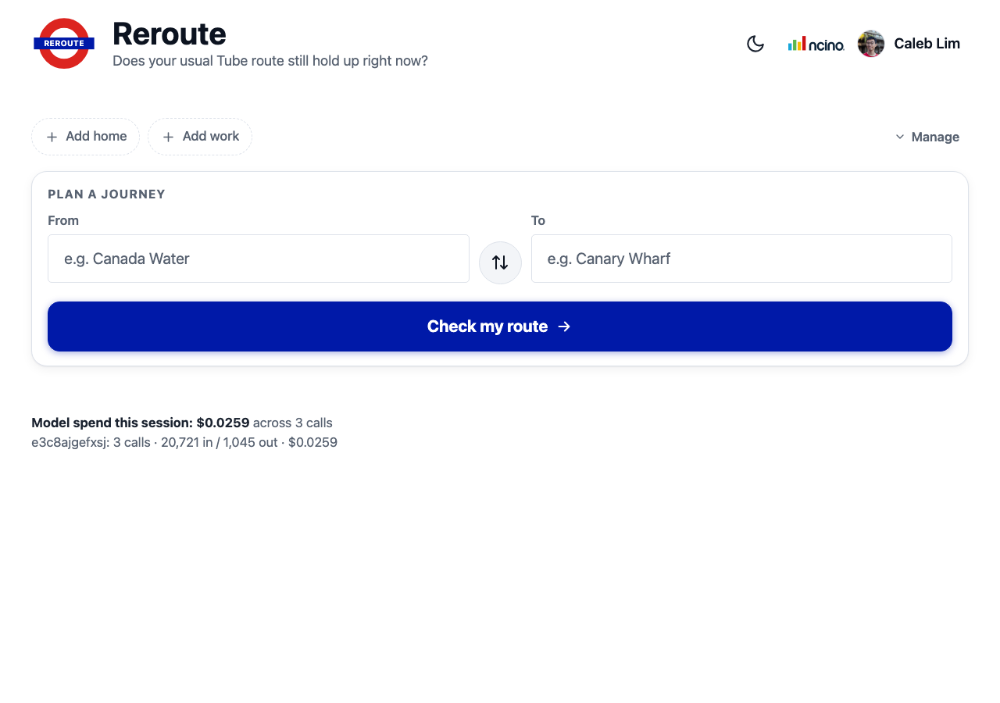
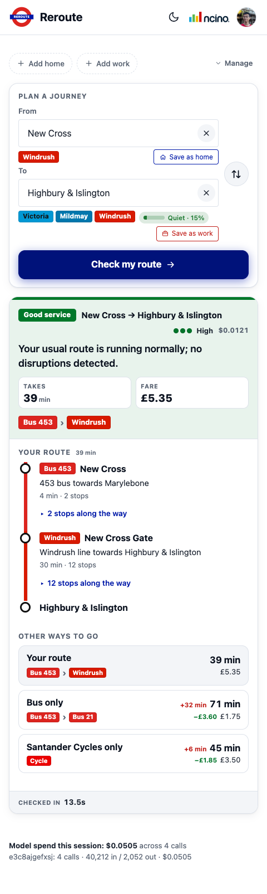
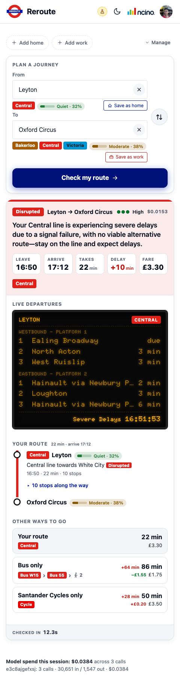
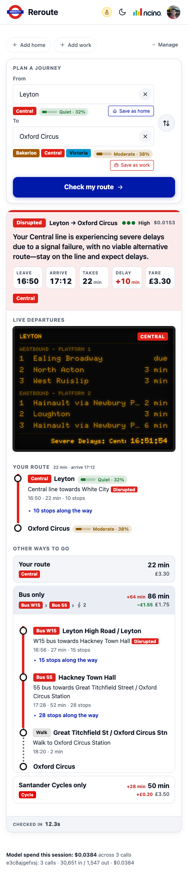

# Reroute

**Your London commute, reasoned about — not just routed.**

Type a London from/to pair (or tap your saved home/work). Reroute plans the trip, checks
live TfL line status against it, and gives a plain-English verdict: *"Your usual route
still holds"* or *"Take this route instead"* — with the live journey, timing, and
confidence shown. It also shows the exact route to take, live crowding at each station,
Santander Cycles dock availability for any cycle leg, and a TfL-style departure board for
where you board.

Bun + Hono backend calls the TfL Unified API for live journeys, crowding, and line status,
then hands that data to a Claude agent (via Amazon Bedrock) that returns a plain-English
verdict. See [PLAN.md](PLAN.md) for the full architecture and the decisions behind it.



| Good service | Disrupted (demo mode) |
|---|---|
|  |  |

The disrupted verdict above is running Demo mode's Central-line "severe delays" preset;
its "Other ways to go" list expands into a full stop-by-stop bus itinerary:



## Why

Your usual Tube route might be disrupted right now, and checking line status yourself
takes several taps across the TfL app. Reroute does that check for you and tells you the
truth in one line.

## Core features

- **Rerouting — live journey swap-in.** When the model decides your usual route no longer
  holds, the page swaps in a real, live TfL journey as the recommendation — not a guess.
- **Alternatives.** Every verdict card also carries tube-only, bus-only, and Santander
  Cycles-only options, priced and timed against the recommended route, each expandable to
  its own stop-by-stop itinerary.
- **Live departure board.** A TfL-style amber board for your first leg, refreshing every
  20s, marking your platform and scrolling line status along the bottom.
- **Live crowding** at each station along the route.
- **Cycle-hire awareness.** Any cycle leg shows the nearest real Santander Cycles docking
  station (with live bike/dock counts) and an estimated Day Pass / e-bike fare, since TfL's
  own journey planner and fare API don't do either.
- **Autocomplete and saved stations.** Start typing a station name for instant suggestions
  with line pills and live crowding; save a home and work station for one-tap checks, with
  the likely direction (morning/evening) listed first.
- **Demo mode.** A dev panel (profile menu → Demo mode) injects a synthetic disruption at
  the tool layer the agent calls, so a live demo doesn't depend on TfL actually having a
  bad day — see [Demo mode](#demo-mode) below.

## Under the hood

- **Warm subprocess pre-spawning.** One Claude Code subprocess is kept ready ahead of the
  next request, cutting the ~4s cold-spawn cost off most checks.
- **Schema-constrained model output.** The agent's final answer is forced through a JSON
  schema, so the server always gets a parseable verdict instead of occasionally-malformed
  prose.
- **Restricted tool surface.** The agent gets exactly four read-only TfL tools and nothing
  else — no built-in tools, no filesystem access, no `~/.claude` settings leaking into a
  server process.
- **Live-vs-usual signature matching.** Today's live journey is matched to the normal-day
  baseline by mode/line signature, not by guesswork, so "your route" is provably the same
  route.
- **Server-side cancel-in-flight.** Starting a new check interrupts any still-running
  previous check on the server, not just hiding it in the browser.
- **Disruption timestamps.** `get_line_disruption_detail` carries `reportedAt` /
  `expectedEnd`, so the model can say "unknown" instead of guessing how long an incident
  will last.

## Demo mode

Real TfL data is noisy: running the same query against a genuinely disrupted line doesn't
always reproduce the same verdict twice, because the agent is reasoning over live data, not
following a script. That's real evidence the agent works — but it also means a live
disruption can't be relied on to reproduce reliably for a demo.

Demo mode (profile menu → Demo mode) fixes that by injecting a synthetic disruption
straight into the `get_line_status` / `get_line_disruption_detail` tool results the agent
calls. The model still reasons genuinely over the data — it just isn't real TfL data — and
the departure board ticker and each leg's "Disrupted" tag are overridden too, so the whole
page agrees with the verdict instead of the text alone claiming a delay nothing else shows.

## Run it locally

Prerequisites: [Bun](https://bun.sh) (installed at `~/.bun/bin`), the AWS CLI, and a TfL
API key.

```sh
export PATH="$HOME/.bun/bin:$PATH"
bun install

cp .env.example .env          # then fill in TFL_APP_KEY and VERDICT_MODEL_ID
aws sso login --profile genai # SSO credentials expire, so log in right before a demo

bun run start                 # http://localhost:3000
```

`.env` is gitignored and must never be committed. Secrets are read only from the
environment.

All scripts run `bun --use-system-ca`. Without it, Bun rejects the Zscaler-signed TLS
certificates on this network and every TfL call fails.

### Other commands

| Command | What it does |
|---|---|
| `bun run dev` | Server with hot reload |
| `bun run probe:tfl` | Hits the TfL tools directly (no AI) and shows cache hits |
| `bun run probe:agent "From" "To"` | Runs one verdict from the CLI and prints the token cost |
| `curl localhost:3000/healthz` | Checks config: which values are present, without showing them |

## Demo script

1. **Autocomplete:** start typing "bank". Suggestions appear instantly, with line pills and
   live crowding for the highlighted station.
2. **Saved stations:** pick a station and click "Set as home", then pick another and click
   "Set as work". One-tap "Check now" buttons appear, and the morning or evening direction is
   listed first depending on the time of day.
3. **Check a route:** the gauge's train moves as the agent actually works (finding
   stations, planning, checking lines, reading notices, writing the verdict).
4. **Result:** the verdict, the exact route as a line-coloured strip map with live times and
   crowding, and a live amber departure board for your first leg. The board refreshes every
   20s, marks your platform, and scrolls line status along the bottom.
5. **Disrupted line:** pick a pair on whichever line is currently disrupted (or use
   [demo mode](#demo-mode) to fake one on demand).

## How it was built

Built in one working session, six checkpoints between ~09:00 and ~13:00:

| Checkpoint | Time | What shipped |
|---|---|---|
| 1 | 10:41 | TfL tools + Agent SDK verdict |
| 2 | 10:51 | Autocomplete & saved stations |
| 3 | 11:16 | Expanded TfL tooling |
| 4 | 11:43 | Branding pass |
| 5 | 12:07 | Resilience + polish |
| 6 | 13:00 | Final UI pass |

Notable problems solved along the way:

- **Runtime constraint:** the spec called for Cloudflare Workers, but the Claude Agent SDK
  spawns a subprocess, and Workers has no process spawning. Resolved by moving to a
  long-lived Bun process instead.
- **Model access:** verified which Bedrock routes were actually invokable (application
  inference profiles only — direct model IDs are blocked by an account SCP) before writing
  the agent code, avoiding a dead end later.
- **Live-vs-usual routing logic:** matched today's live journey to the user's usual route by
  mode/line signature, so "your route" only shows real, live TfL data — not a guess.

Further detail — including per-checkpoint screenshots, token-usage-by-feature breakdowns,
and the roadmap — lives in `Reroute_AI_Skills_Day.pptx` / `Reroute_progress.pptx` in this
repo.

## Roadmap

- Persistent usage logging (today's cost/token breakdowns had to be reconstructed from
  session transcripts — worth writing straight to disk).

## Stack

Bun, Hono, htmx, Pico.css, TypeScript. The verdict comes from a [Claude Agent
SDK](https://docs.claude.com/en/api/agent-sdk/overview) agent running on Amazon Bedrock,
restricted to four read-only TfL tools. See [PLAN.md](PLAN.md) for the full architecture,
including the Bedrock model-access constraints and why Cloudflare Workers was dropped from
the original spec.
